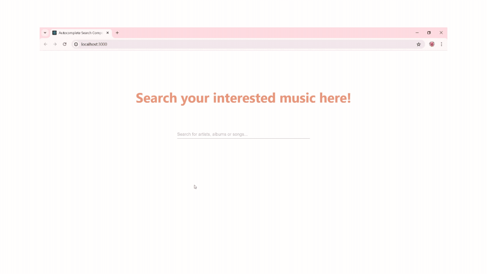

# mmc-autocomplete-search
This project implements an autocomplete search component for artists, albums, or songs. The frontend is built using React.js and Material-UI, and the backend uses Node.js with a MongoDB Atlas database. The application supports responsive design to provide a seamless experience across different screen sizes. This application has been containerized using Docker.

## Features
 - Autocomplete search for singers, albums, and songs
 - Display different details based on the type of results
 - Instant search results as you type
 - Give no result found information when there is no matched data in database
 - Responsive design for seamless experience on different screen sizes

## Installation and running
### Clone the Repository
    git clone git@github.com:yuanjundu/mmc-autocomplete-search.git

### Add .env file 
There are .env.example files in both the backend and frontend directories. Please create .env files in the root directories of both the backend and frontend, using the respective .env.example files as references.

### Run with Docker
After creating the .env files, run
    docker-compose up
Then open http://localhost:3000 in the browser.

### Run without Docker
### Prerequisites
- Node.js (v12 or later)
- npm (v6 or later)

### Start the Backend Server
    cd backend
    npm install
    node server.js

### Start the Frontend Development Server
Open another terminal and run the following code:

    cd frontend
    npm install
    npm start
The application will start on http://localhost:3000.

## Usage
- Make sure you are running the backend server
- Open your web browser and navigate to http://localhost:3000.
- Type a artist, album, or song name in the search input line
- The application will display matched autocomplete results as you type

### Demo

